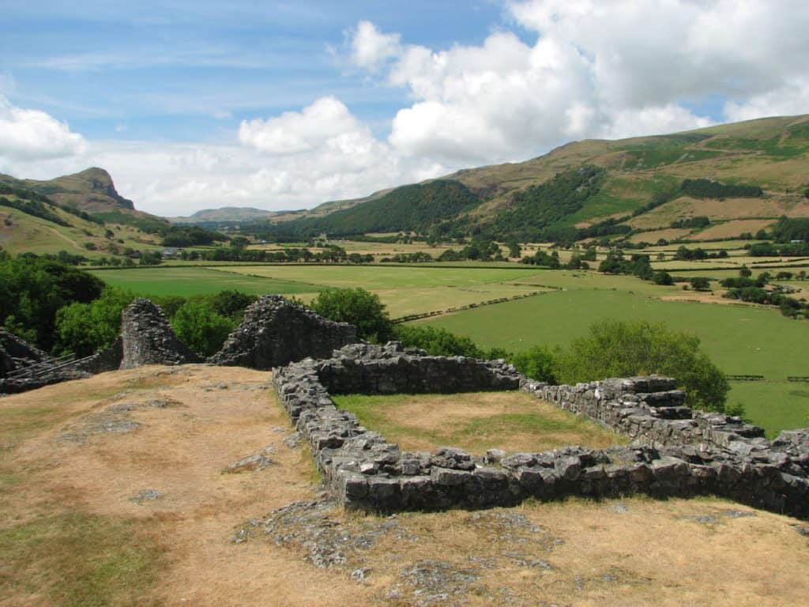

It may be remote, but Castell y Bere in North Wales is a magnet for all castle lovers. Strung along a jagged rocky outcrop in the Dysynni Valley at the foot of the mighty Cader Idris, Castell y Bere is especially good at evoking the spirit and atmosphere of Wales’s native castles.

Built by Welsh ruler <em>Llywelyn ap Iorwerth</em> (Llywelyn the Great) to protect Gwynedd’s southern frontier, construction began in 1221 with the castle remaining in use until 1294. Castell y Bere was a remote outpost on Llywelyn’s southern frontier, but it was vital to his security. Llywelyn ab Iorwerth was Prince, but in those days cattle were king! Castell y Bere guarded his cattle range, protected the homeland of Gwynedd and dominated the neighbouring lordship of Meirionydd.

A short walk from the carpark leads to the castle, offering a pleasant exploration of the surrounding natural scenery.

Today Castell y Bere under the protection of Cadw rather than the Welsh Princes, but it is as wild and remote as it was when Llywelyn first arrived. It stretches along the summit of a rocky outcrop on the eastern side of the Dysynni valley. Distinctive features at Castell y Bere include the characteristic Welsh apsidal – or elongated D-shaped plan of the south tower.

The proximity to Snowdonia National Park enhances the allure of visiting Castell y Bere, with numerous walking opportunities and scenic beauty.

Strung along a jagged rocky outcrop in the Dysynni Valley at the foot of the mighty <a href="/things-to-do/cadair-idris/">Cadair Idris</a>, Castell y Bere is especially good at evoking the spirit and atmosphere of Wales’s native castles.
<h2>Castell y Bere Virtual Tour</h2>

<iframe style="border: 0;" src="https://www.4piproductions.com/castellybere/" title="Castell y Bere virtual tour" loading="lazy" referrerpolicy="no-referrer-when-downgrade" allow=""></iframe>

<small>Virtual tour provided by Cadw</small>
<h2>How to get to Castell y Bere</h2>
To get to Castell y Bere, take the A483 north-east from Tywyn, turn right onto the B4405 (signed to Talyllyn) to Abergynolwyn and left in the village at the signpost to Castell y Bere.

You'll see a visitor information board at the car park providing some wonderful information about the castle ruins, which are then just a short walk from this car park. There’s enough parking for up to a dozen vehicles, and parking at Castell y Bere is free.
<h2>Are dogs allowed at Castell y Bere</h2>
Yes - dogs are allowed up to Castell y Bere.
