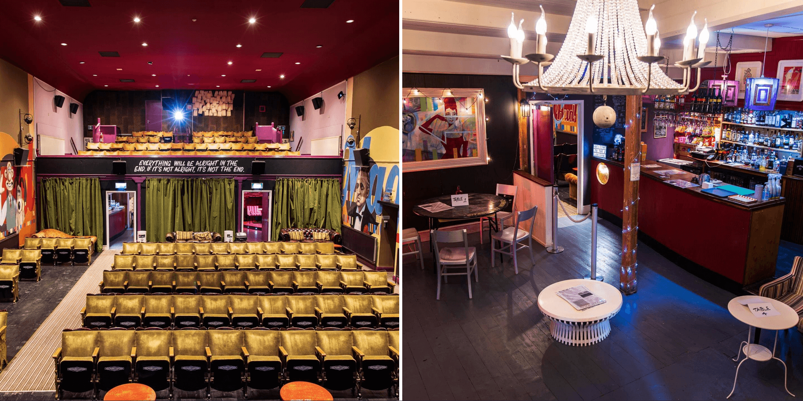

Come to the Magic Lantern Cinema in Tywyn – the UK’s best Independent Cinema! Watch the latest films on Tywyn Cinema’s amazing 3D projector, their top-of-the-range 7.1 surround sound and with a cracking fully-stocked bar – you’re certain to have a great time! Doors open 30 mins before each screening – subtitles are available on Mondays. Heard of Hearing (HOH) showings are often on Mondays, and will be mentioned next to the times in each film.

Find out <a href="https://www.tywyncinema.co.uk" target="_blank" rel="noopener">what’s on in Tywyn cinema this month</a>.

<h2>Tywyn Cinema’s History</h2>
Tywyn’s Magic Lantern Cinema has been in Tywyn since 1893. First built as the town assembly rooms it’s been used for holding badminton practice and variety performances, and has been showing films for over 120 years! Today you can watch the latest films, Live Streaming from The RSC and National Theatre, as well as live comedy and live music.
