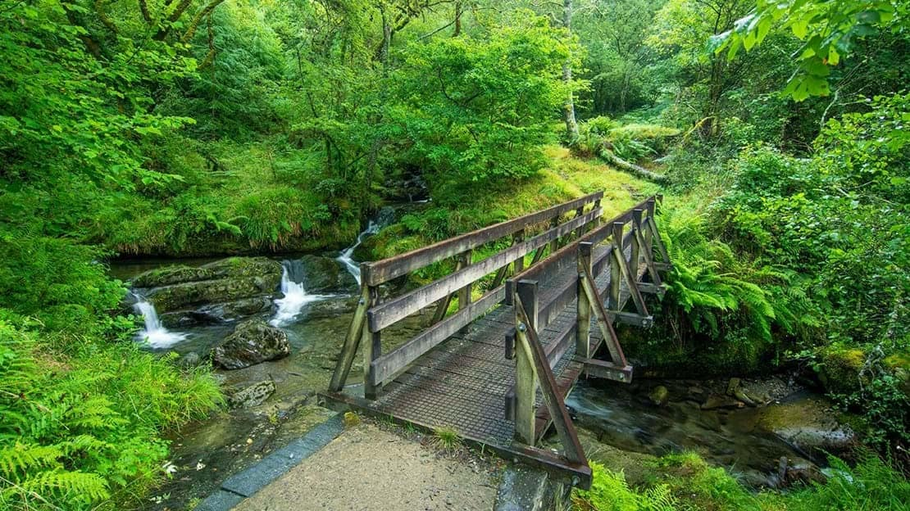
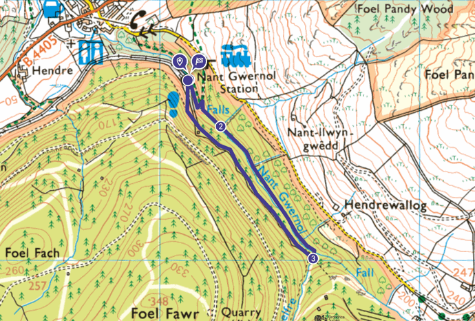

The stunning ancient woodland of Nant Gwernol offers amazing views and diverse habitats, with rare wildlife.

Follow the established riverside footpath through Coed Nant Gwernol for a beautiful scenic walk which passes flowing streams, tumbling waterfalls and deep pools.

If you're feeling adventurous, you can try the 4 mile Quarryman's Trail. A circular walk with long climbs and steep descents which are rewarded with great views of Cader Idris, waterfalls and the ruined mine workings of Bryn Eglwys quarry.

Nant Gwernol woodland has a diverse range of wildlife, including rare hazel dormice, bats, many species of bird and a variety of invertebrates. Also look out for otters foraging along the river!

<h2>How to get to Nant Gwernol Forest?</h2>
To get to Nant Gwernol, you can either park in the village of Abergynolwyn (around 15 minutes drive from <a href="/things-to-do/tywyn-beach/">Tywyn</a>), or get the <a href="/things-to-do/the-talyllyn-railway/">Talyllyn railway</a> stright into the heart of the forrest.
<h2>Nant Gwernol map</h2>
<a href="https://explore.osmaps.com/route/12688392/bbc-countryfile-magazine-nant-gwernol-gwynedd-wales?lat=52.639447&amp;lon=-3.942535&amp;zoom=14.4732&amp;overlays=&amp;style=Leisure&amp;type=2d&amp;placesCategory=" target="_blank" rel="noopener">Nant Gwernol walking route and map</a>

